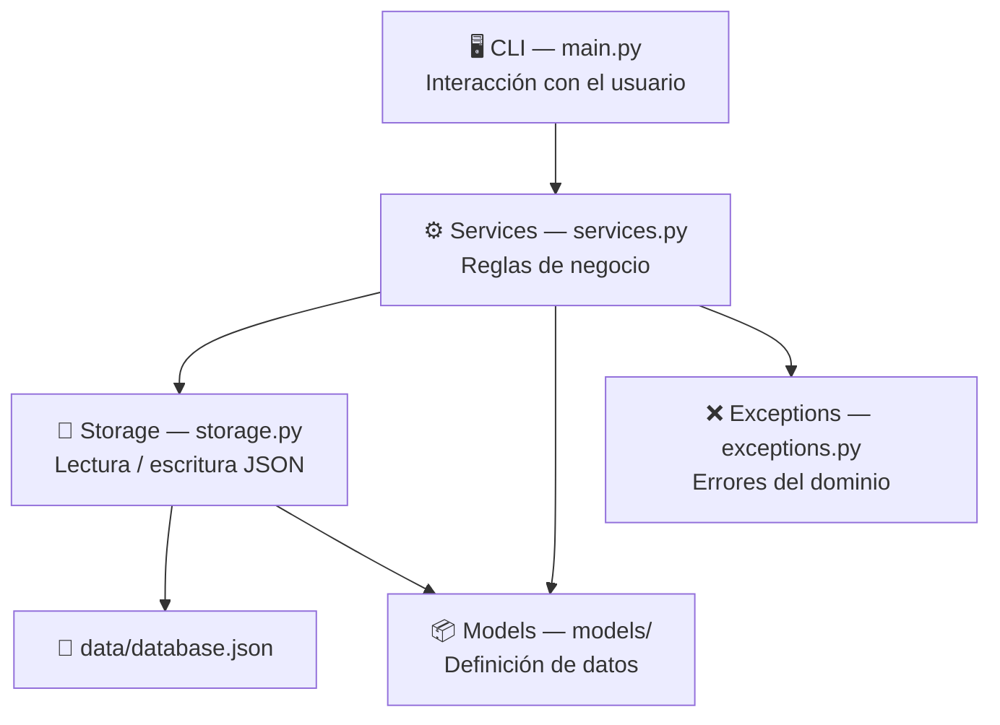

 Arquitectura

## Separación por capas

El proyecto sigue una arquitectura de **4 capas estrictas**. Ninguna capa se salta un nivel.



| Capa | Responsabilidad |
|---|---|
| **CLI** | Parsear comandos, mostrar tablas y mensajes con Rich/Typer |
| **Services** | Validar reglas de negocio, coordinar modelos y storage |
| **Storage** | Única capa autorizada para leer/escribir el JSON |
| **Models** | Definir la estructura de datos y validar sus propios campos |

---

## src layout

El código fuente vive en `src/hotel_manager/` en lugar de estar en la raíz del proyecto. Esto evita que Python importe el paquete local accidentalmente en lugar del instalado, y es la convención recomendada por la PyPA.

---

## Organización de modelos

Cada entidad tiene su propio archivo dentro de `src/hotel_manager/models/`:

```
models/
├── __init__.py       # Re-exporta Habitacion y Reserva
├── habitacion.py     # Dataclass Habitacion + validaciones
└── reserva.py        # Dataclass Reserva + validaciones
```

Las validaciones se implementan con `__post_init__` y métodos privados auxiliares (`_validar_tipo`, `_validar_email`, etc.), siguiendo el principio de que **el modelo es responsable de su propia integridad**.

---

## Excepciones propias

Todas las excepciones heredan de `HotelError`, lo que permite capturarlas en bloque en la CLI:

```python
except HotelError as e:
    console.print(f"[red]Error:[/red] {e}")
```

---

## Complejidad ciclomática

El proyecto mantiene complejidad promedio **A** (la más baja) verificada con `radon`:

```bash
uv run radon cc src -a
```

Esto se valida automáticamente en el workflow de CI.