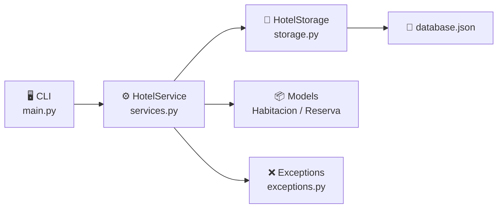

# 🏨 Hotel Manager

**Sistema de administración de habitaciones de hotel** desarrollado en Python, con CLI interactiva, persistencia en JSON y arquitectura por capas.

---

## ¿Qué hace?

Hotel Manager permite gestionar el ciclo completo de un hotel pequeño desde la terminal:

- **Habitaciones** — registrar, actualizar, consultar y eliminar habitaciones (simple, doble, suite).
- **Reservas** — crear y cancelar reservas con validación automática de disponibilidad y fechas.
- **Ingresos** — consultar el total acumulado por reservas completadas.

---

## Características principales

!!! tip "CLI con colores"
    Todos los comandos usan `Rich` para mostrar tablas y mensajes en color directamente en la terminal.

!!! info "Validaciones en los modelos"
    Los modelos `Habitacion` y `Reserva` usan `__post_init__` para validar sus datos en el momento de creación.

!!! note "Sin base de datos externa"
    Toda la información se persiste en un archivo `data/database.json`. No se necesita instalar ningún motor de base de datos.

---

## Arquitectura general

Cada capa tiene una responsabilidad única y no se salta niveles: la CLI nunca toca el JSON directamente.

---

## Tecnologías

| Herramienta | Uso |
|---|---|
| `Typer` | Definición de comandos CLI |
| `Rich` | Tablas y mensajes con color |
| `uv` | Gestión del entorno y dependencias |
| `pytest` | Pruebas unitarias |
| `ruff` | Linter y formato |
| `radon` | Medición de complejidad ciclomática |
| `mkdocstrings` | Documentación automática desde docstrings |
