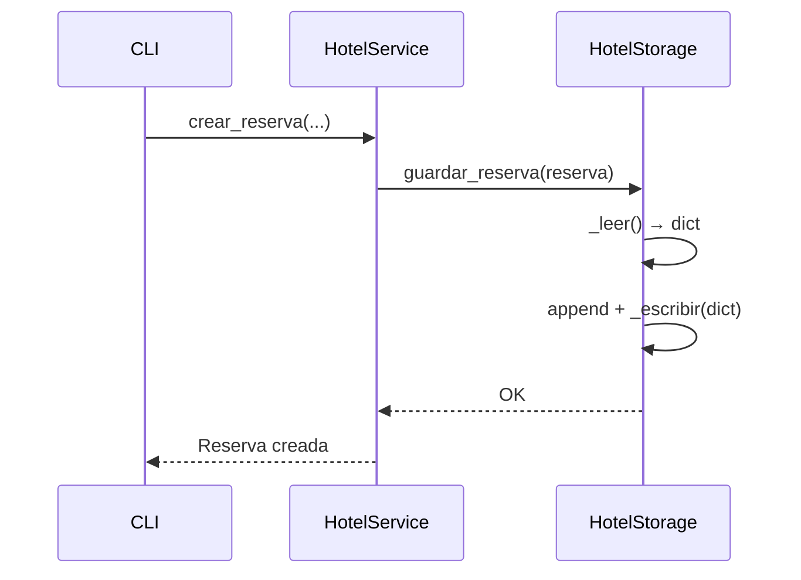

# Persistencia de Datos

Hotel Manager usa un archivo JSON local como base de datos. No requiere ningún motor externo.

---

## Archivo JSON

La base de datos se encuentra en `data/database.json`. Contiene dos colecciones: `habitaciones` y `reservas`.

```json
{
  "habitaciones": [ ... ],
  "reservas": [ ... ]
}
```

---

## Estructura de los datos

### Habitación

```json
{
  "id": 1,
  "numero": "101",
  "tipo": "simple",
  "precio_por_noche": 80.0,
  "disponible": true
}
```

| Campo | Tipo | Descripción |
|---|---|---|
| `id` | `int` | Identificador único autoincremental |
| `numero` | `str` | Número visible en el hotel |
| `tipo` | `str` | `simple`, `doble` o `suite` |
| `precio_por_noche` | `float` | Tarifa en USD |
| `disponible` | `bool` | `true` si está libre |

### Reserva

```json
{
  "id": 1,
  "habitacion_id": 2,
  "nombre_huesped": "María García",
  "email_huesped": "maria@email.com",
  "fecha_entrada": "2025-04-01",
  "fecha_salida": "2025-04-05",
  "total": 480.0,
  "estado": "activa"
}
```

| Campo | Tipo | Descripción |
|---|---|---|
| `id` | `int` | Identificador único autoincremental |
| `habitacion_id` | `int` | FK a la habitación reservada |
| `nombre_huesped` | `str` | Nombre completo |
| `email_huesped` | `str` | Correo de contacto |
| `fecha_entrada` | `str` | Formato `YYYY-MM-DD` |
| `fecha_salida` | `str` | Formato `YYYY-MM-DD` |
| `total` | `float` | Noches × precio calculado automáticamente |
| `estado` | `str` | `activa` o `completada` |

---

## Serialización de modelos

Cada modelo (`Habitacion`, `Reserva`) implementa dos métodos para la conversión:

```python
# De objeto a diccionario (para guardar en JSON)
habitacion.to_dict()

# De diccionario a objeto (al cargar desde JSON)
Habitacion.from_dict(data)
```

!!! note "Responsabilidad única"
    Solo `HotelStorage` lee y escribe el archivo. Ninguna otra capa accede directamente al JSON.

---

## Flujo de escritura


